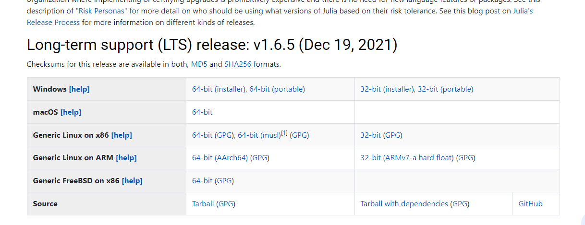

# Pasos para instalar Anaconda, Jupyter Notebook y Spyder (IDE de python), R y R studio (IDE de R), Julia y Git-Hub Desktop

##  Instalación de Anconda

¿Qué es anaconda?

Anaconda es una Suite de código abierto que abarca una serie de aplicaciones, librerías y conceptos diseñados para el desarrollo de la Ciencia de datos con Python. En líneas generales Anaconda Distribution es una distribucción de Python que funciona como un gestor de entorno, un gestor de paquetes y que posee una colección de +720 paquetes de código abierto.

- [Caso 1: Anaconda o python no están instalados en la computadora](#case_1)
  * [I. Instalar Anaconda](#anaconda)
- [Case 2: Anaconda o Python está instalado](#case_2)
  * [I. Python instalado pero no anaconda](#Py_A)
  * [II. Solo Anaconda instalado](#justA)
  

##  **Caso 1: Anaconda o python no están instalados en la computadora**

### I. Instalación

Seguir los siguientes pasos con cuidado. Darse un tiempo para ello.

1. Descargar anaconda del siguiente enalce [website](https://www.anaconda.com/products/individual#windows). 
2. Una vez descargado, haga doble clic en el instalador para iniciar. Haga clic en Siguiente y en "I agree". Después de eso, seleccione una instalación para "just me" y haga clic en Siguiente.
3. Luego, el instalador de Anaconda le pedirá una carpeta de destino para instalar. Le recomiendo que la carpeta sea la opción predeterminada. 

Es importante tener en cuenta que la ruta del directorio (carpeta de destino) no contiene espacios ni caracteres Unicode (! % $).

## El siguiente paso es importante
4.  Para instalar correctamente Anaconda para nuestros propósitos. Elija "Register Anaconda3 as my default Python 3.7". 

5. Finalmente, haga clic en el botón Instalar y espere un poco. Después de una instalación exitosa, aparecerá “Thanks for installing Anaconda”
6. Después de la instalación, verá un nuevo programa instalado en su PC escribiendo "Anaconda" en Windows.

## **Case 2: You have installed Python or Anaconda before**

> **_Recomendaciones:_** 
> 1. Recomendamos encarecidamente desinstalar Python por completo. Incluso algunas carpetas que quedan pueden causar problemas con los paquetes en el futuro. Así que asegúrese de no tener carpetas nombradas "Python" or "Anaconda".

###  I. Python instalado pero no Anaconda
Para instalar Anaconda correctamente, Python debe eliminarse por completo de su sistema. [click](https://www.educative.io/edpresso/how-to-uninstall-python) Elija el sistema operativo según corresponda. 

###  II. Anaconda instalado

Le recomendamos que desinstale Anaconda por completo para establecer las configuraciones correctamente. Para hacerlo, asegúrese de desinstalar Anaconda correctamente siguiendo estos [pasos](https://docs.anaconda.com/anaconda/install/uninstall/). Incluso las carpetas que quedan pueden causar problemas con los paquetes en el futuro. Así que asegúrese de no tener carpetas llamadas "Python" o "Anaconda".

Si prefiere mantener Anaconda como la instaló en el pasado, asegúrese de **no tener Anaconda agregada a su entorno PATH, ya que podría tener problemas para crear un nuevo entorno**.

> **_Recomendaciones:_** 
> 1. Recomendamos encarecidamente desinstalar Python por completo. Incluso algunas carpetas que quedan pueden causar problemas con los paquetes en el futuro. Así que asegúrese de no tener carpetas nombradas "Python" or "Anaconda".

### III. Jupyter notebook y Spyder

- Ir a inicio y abrir Anaconda Navigator 

- Luego de algunos minutos se abrira una ventana. Luego, si las opciones debajo de cada icono de Jupyter notebook y Spyder aparace install, entonces haga click en install. Caso contrario aparecerá la opción launch, si es así, entonces ambos programadas ya están instalados por default. Haga click en launch y abrirá cada programa.

#### Jupyter notebook 

#### Spyder

## Intalación de R

Primero, si tienes instalado R y R studio en tu computadora. El siguiente paso sería actualizar la versión con los siguientes comandos:

install.packages("installr")

library(installr)

updateR()

Si no se cuenta con los programas, seguir los siguientes pasos:

## 

1. Dirigirse al siguiente enlace de [CRAN](https://cran.r-project.org/)
2. Elegir el sistema operativo 

3. Elegir instalar R por primera vez

4. Finalmente, descargar, dar ejecutar al programa descargado y aceptar las indicaciones de instalación

##  Instalación de R studio 

1. Descargamos el programa del siguiente link [R studio](https://www.rstudio.com/products/rstudio/download/)

2. Ejecutar el programa y aceptar las indicaciones de instalación

##  Instalación de julia 

Primero ¿Por qué usar Julia?

Julia es un lenguaje de programación dinámico de alto nivel. Es utilizado por investigadores y profesionales de aprendizaje automático, ya que está desarrollando rápidamente una cantidad enorme de paquetes y marcos de aprendizaje automático.

Un lenguaje de programación que compite con Python es Julia. Además de Python, Julia también es un lenguaje de programación de alto nivel, en el que podemos escribir menos cantidad de código que en Python. Sin embargo, si comparamos la velocidad de Python con la de Julia, aquí Julia saca ventaja. Julia es mucho más rápida que Python, y además soluciona su limitación de velocidad. 

instalación:

1. Dirigirse al siguiente enlace [click](https://julialang.org/downloads/)

2. Dirigirse a la seccón Long-term support (LTS). Este será la versión de Julia que usaremos. Seleccionar el sistema operativo (64-bit installer para windows) 

3. Ejecutar el programa, aceptar las indicaciones y listo. 

4. Settear Julia en Jupyter notebook: Ahora podemos acceder a la terminal de Julia. En tu barra de búsqueda, escribe Julia y abre la terminal.

En la terminal de Julia, escribe

     using Pkg

Eso es similar a la instrucción *import* en Python.

Ahora escribe el siguiente comando:

     Pkg.add(“IJulia”)
    
El código anterior agrega el paquete IJulia al IDE de Jupyter Notebook, al que podemos acceder usando Anaconda Navigator.

Después de ejecutar esos comandos, espere de 3 a 4 minutos. Establecerá automáticamente una conexión entre Julia y Jupyter Notebook, y ahora se puede crear un nuevo Jupyter Notebook con Julia.

##  Instalación de Git-Hub Desktop

Crear cuenta de Git-Hub usando el correo de la Universidad  [click](https://github.com/). Luego, instalar Git-hub Desktop [click](https://desktop.github.com/). El aplicativo estará asociado a su cuenta activa de Git-Hub. En la primera clase de enseñará como crear su propio repositorio y clonar el repositorio del curso. Clonar el repositorio del curso requeiere ingresar su cuenta de Git-Hub en el excel comaprtido por el correo. De esta manera yo pueda integrarlo al repositorio como usuario.

